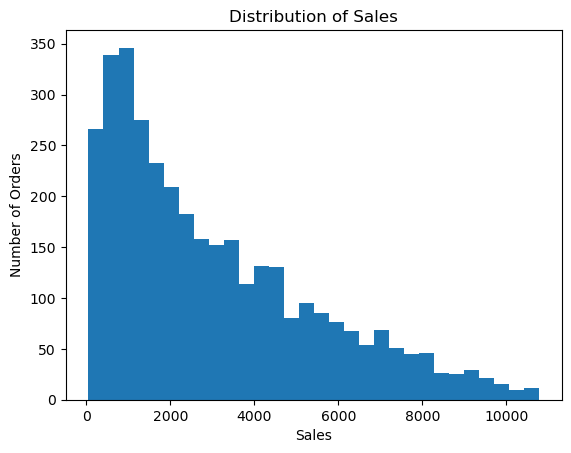
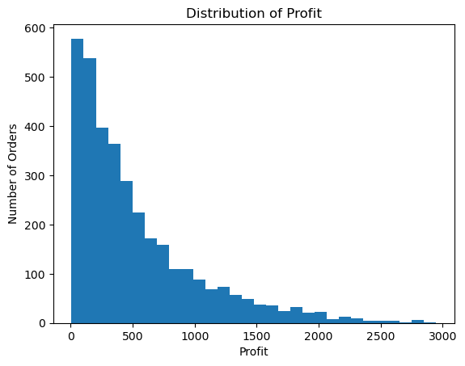
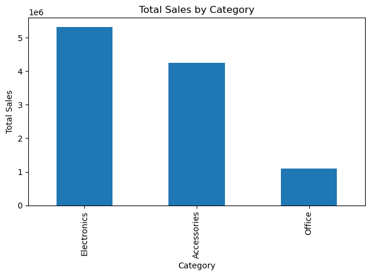
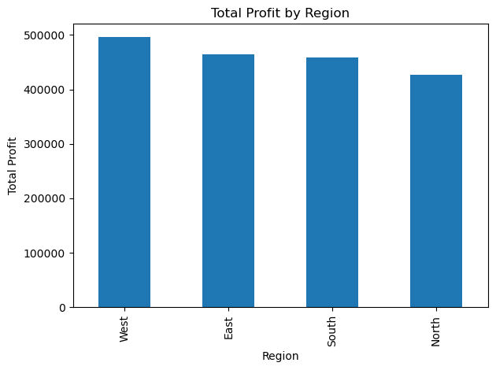
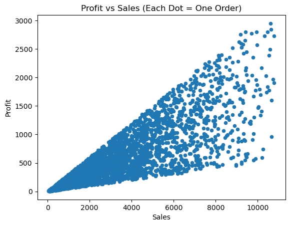
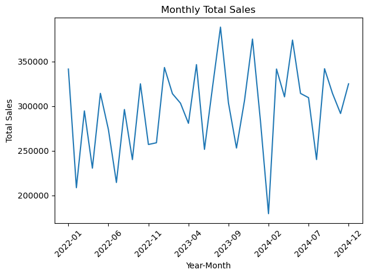
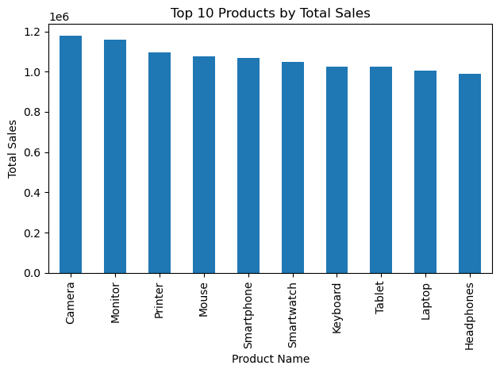
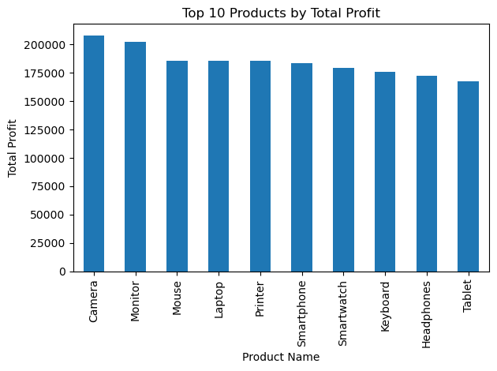

# E-commerce Sales EDA (My Little Data Project)

Today I’m going to explore a dataset about e-commerce orders.

I want to understand a few simple things:
- What do people buy the most?
- Which category makes the most sales?
- Which region makes the most profit?
- Does sales go up or down over time?

I’m going to go step by step, like a journey.


## loading the data


```python
import pandas as pd
import numpy as np 
import matplotlib.pyplot as plt
```


```python
df = pd.read_csv("ecommerce_sales_data.csv")

df.shape

```


    (3500, 7)


```python
df.columns
```


    Index(['Order Date', 'Product Name', 'Category', 'Region', 'Quantity', 'Sales',
           'Profit'],
          dtype='object')


```python
df.head()

```


<div>
<style scoped>
    .dataframe tbody tr th:only-of-type {
        vertical-align: middle;
    }

    .dataframe tbody tr th {
        vertical-align: top;
    }

    .dataframe thead th {
        text-align: right;
    }
</style>
<table border="1" class="dataframe">
  <thead>
    <tr style="text-align: right;">
      <th></th>
      <th>Order Date</th>
      <th>Product Name</th>
      <th>Category</th>
      <th>Region</th>
      <th>Quantity</th>
      <th>Sales</th>
      <th>Profit</th>
    </tr>
  </thead>
  <tbody>
    <tr>
      <th>0</th>
      <td>2024-12-31</td>
      <td>Printer</td>
      <td>Office</td>
      <td>North</td>
      <td>4</td>
      <td>3640</td>
      <td>348.93</td>
    </tr>
    <tr>
      <th>1</th>
      <td>2022-11-27</td>
      <td>Mouse</td>
      <td>Accessories</td>
      <td>East</td>
      <td>7</td>
      <td>1197</td>
      <td>106.53</td>
    </tr>
    <tr>
      <th>2</th>
      <td>2022-05-11</td>
      <td>Tablet</td>
      <td>Electronics</td>
      <td>South</td>
      <td>5</td>
      <td>5865</td>
      <td>502.73</td>
    </tr>
    <tr>
      <th>3</th>
      <td>2024-03-16</td>
      <td>Mouse</td>
      <td>Accessories</td>
      <td>South</td>
      <td>2</td>
      <td>786</td>
      <td>202.87</td>
    </tr>
    <tr>
      <th>4</th>
      <td>2022-09-10</td>
      <td>Mouse</td>
      <td>Accessories</td>
      <td>West</td>
      <td>1</td>
      <td>509</td>
      <td>103.28</td>
    </tr>
  </tbody>
</table>
</div>


## Now I'll check the “Data quality (health)” of the dataset

I want to check:
- Are there missing values?
- Are there duplicates?
- Do the data types look correct?

If something looks weird, I’ll write it down in mardown cells


```python
df.info()

```

    <class 'pandas.core.frame.DataFrame'>
    RangeIndex: 3500 entries, 0 to 3499
    Data columns (total 7 columns):
     #   Column        Non-Null Count  Dtype  
    ---  ------        --------------  -----  
     0   Order Date    3500 non-null   object 
     1   Product Name  3500 non-null   object 
     2   Category      3500 non-null   object 
     3   Region        3500 non-null   object 
     4   Quantity      3500 non-null   int64  
     5   Sales         3500 non-null   int64  
     6   Profit        3500 non-null   float64
    dtypes: float64(1), int64(2), object(4)
    memory usage: 191.5+ KB
    


```python
df.isna().sum().sort_values(ascending=False)

```


    Order Date      0
    Product Name    0
    Category        0
    Region          0
    Quantity        0
    Sales           0
    Profit          0
    dtype: int64


```python
df.duplicated().sum()

```


    np.int64(0)


## fixing one important thing (Order Date)

Dates are special.
If I want to make a time chart (like sales per month), I need the date column to be a real date type.

This is not deep “cleaning”. This is just making the data usable for graphs.


```python
df["Order Date"] = pd.to_datetime(df["Order Date"], errors="coerce")

print("Date range:")
print("Start:", df["Order Date"].min())
print("End:  ", df["Order Date"].max())

```

    Date range:
    Start: 2022-01-01 00:00:00
    End:   2024-12-31 00:00:00
    

## now i ll  do quick summary stats

Like:
- average sales
- min and max
- typical profit


```python
df.describe()
```


<div>
<style scoped>
    .dataframe tbody tr th:only-of-type {
        vertical-align: middle;
    }

    .dataframe tbody tr th {
        vertical-align: top;
    }

    .dataframe thead th {
        text-align: right;
    }
</style>
<table border="1" class="dataframe">
  <thead>
    <tr style="text-align: right;">
      <th></th>
      <th>Order Date</th>
      <th>Quantity</th>
      <th>Sales</th>
      <th>Profit</th>
    </tr>
  </thead>
  <tbody>
    <tr>
      <th>count</th>
      <td>3500</td>
      <td>3500.000000</td>
      <td>3500.000000</td>
      <td>3500.000000</td>
    </tr>
    <tr>
      <th>mean</th>
      <td>2023-07-13 00:53:53.828571648</td>
      <td>4.931714</td>
      <td>3047.966000</td>
      <td>527.047203</td>
    </tr>
    <tr>
      <th>min</th>
      <td>2022-01-01 00:00:00</td>
      <td>1.000000</td>
      <td>51.000000</td>
      <td>6.970000</td>
    </tr>
    <tr>
      <th>25%</th>
      <td>2022-10-16 18:00:00</td>
      <td>3.000000</td>
      <td>1049.500000</td>
      <td>158.695000</td>
    </tr>
    <tr>
      <th>50%</th>
      <td>2023-07-21 12:00:00</td>
      <td>5.000000</td>
      <td>2350.500000</td>
      <td>361.070000</td>
    </tr>
    <tr>
      <th>75%</th>
      <td>2024-04-16 06:00:00</td>
      <td>7.000000</td>
      <td>4537.000000</td>
      <td>729.125000</td>
    </tr>
    <tr>
      <th>max</th>
      <td>2024-12-31 00:00:00</td>
      <td>9.000000</td>
      <td>10782.000000</td>
      <td>2946.930000</td>
    </tr>
    <tr>
      <th>std</th>
      <td>NaN</td>
      <td>2.575895</td>
      <td>2440.213237</td>
      <td>504.139732</td>
    </tr>
  </tbody>
</table>
</div>


## Creating a few extra helpful columns

- Profit Margin = Profit / Sales (how much profit per dollar of sales)
- Unit Price (roughly) = Sales / Quantity (about how much each item costs)
- Year and Month from the date (so I can group over time)


```python
df["Profit Margin"] = df["Profit"] / df["Sales"]
df["Unit Price (approx)"] = df["Sales"] / df["Quantity"]

df["Year"] = df["Order Date"].dt.year
df["Month"] = df["Order Date"].dt.month
df["Year-Month"] = df["Order Date"].dt.to_period("M").astype(str)

df.head()

```


<div>
<style scoped>
    .dataframe tbody tr th:only-of-type {
        vertical-align: middle;
    }

    .dataframe tbody tr th {
        vertical-align: top;
    }

    .dataframe thead th {
        text-align: right;
    }
</style>
<table border="1" class="dataframe">
  <thead>
    <tr style="text-align: right;">
      <th></th>
      <th>Order Date</th>
      <th>Product Name</th>
      <th>Category</th>
      <th>Region</th>
      <th>Quantity</th>
      <th>Sales</th>
      <th>Profit</th>
      <th>Profit Margin</th>
      <th>Unit Price (approx)</th>
      <th>Year</th>
      <th>Month</th>
      <th>Year-Month</th>
    </tr>
  </thead>
  <tbody>
    <tr>
      <th>0</th>
      <td>2024-12-31</td>
      <td>Printer</td>
      <td>Office</td>
      <td>North</td>
      <td>4</td>
      <td>3640</td>
      <td>348.93</td>
      <td>0.095860</td>
      <td>910.0</td>
      <td>2024</td>
      <td>12</td>
      <td>2024-12</td>
    </tr>
    <tr>
      <th>1</th>
      <td>2022-11-27</td>
      <td>Mouse</td>
      <td>Accessories</td>
      <td>East</td>
      <td>7</td>
      <td>1197</td>
      <td>106.53</td>
      <td>0.088997</td>
      <td>171.0</td>
      <td>2022</td>
      <td>11</td>
      <td>2022-11</td>
    </tr>
    <tr>
      <th>2</th>
      <td>2022-05-11</td>
      <td>Tablet</td>
      <td>Electronics</td>
      <td>South</td>
      <td>5</td>
      <td>5865</td>
      <td>502.73</td>
      <td>0.085717</td>
      <td>1173.0</td>
      <td>2022</td>
      <td>5</td>
      <td>2022-05</td>
    </tr>
    <tr>
      <th>3</th>
      <td>2024-03-16</td>
      <td>Mouse</td>
      <td>Accessories</td>
      <td>South</td>
      <td>2</td>
      <td>786</td>
      <td>202.87</td>
      <td>0.258104</td>
      <td>393.0</td>
      <td>2024</td>
      <td>3</td>
      <td>2024-03</td>
    </tr>
    <tr>
      <th>4</th>
      <td>2022-09-10</td>
      <td>Mouse</td>
      <td>Accessories</td>
      <td>West</td>
      <td>1</td>
      <td>509</td>
      <td>103.28</td>
      <td>0.202908</td>
      <td>509.0</td>
      <td>2022</td>
      <td>9</td>
      <td>2022-09</td>
    </tr>
  </tbody>
</table>
</div>


## I look at the dataset like a story

Before charts, I want to ask:

What categories exist? OR  What products exist? OR What regions exist?

This helps me understand the “world” inside the dataset.


```python
df["Category"].value_counts()

```


    Category
    Electronics    1742
    Accessories    1401
    Office          357
    Name: count, dtype: int64


```python
df["Region"].value_counts()

```


    Region
    West     898
    South    883
    East     861
    North    858
    Name: count, dtype: int64


```python
df["Product Name"].value_counts()

```


    Product Name
    Monitor       364
    Camera        363
    Smartwatch    363
    Printer       357
    Keyboard      351
    Tablet        350
    Mouse         347
    Headphones    339
    Laptop        336
    Smartphone    330
    Name: count, dtype: int64


# Graph Time!

well im gonna check :

- Is sales usually small or big?
- Are there a few huge orders?
- Which categories and regions win?


## Graph 1: Sales distribution

This shows me if most sales are small, or if there are many big orders.


```python
plt.figure()
df["Sales"].plot(kind="hist", bins=30)
plt.title("Distribution of Sales")
plt.xlabel("Sales")
plt.ylabel("Number of Orders")
plt.show()

```


    

    


## Graph 2: Profit distribution

This shows how profit is spread out.
I also want to see if profit is ever negative (loss).


```python
plt.figure()
df["Profit"].plot(kind="hist", bins=30)
plt.title("Distribution of Profit")
plt.xlabel("Profit")
plt.ylabel("Number of Orders")
plt.show()

print("Min profit:", df["Profit"].min())
print("Number of negative profit rows:", (df["Profit"] < 0).sum())

```


    

    


    Min profit: 6.97
    Number of negative profit rows: 0
    

## Graph 3: Total Sales by Category

This tells me which category makes the most money.


```python
sales_by_category = df.groupby("Category")["Sales"].sum().sort_values(ascending=False)

plt.figure()
sales_by_category.plot(kind="bar")
plt.title("Total Sales by Category")
plt.xlabel("Category")
plt.ylabel("Total Sales")
plt.tight_layout()
plt.show()

sales_by_category

```


    

    


    Category
    Electronics    5326074
    Accessories    4247591
    Office         1094216
    Name: Sales, dtype: int64


## Graph 4: Total Profit by Region

This tells me which region is the best for profit.


```python
profit_by_region = df.groupby("Region")["Profit"].sum().sort_values(ascending=False)

plt.figure()
profit_by_region.plot(kind="bar")
plt.title("Total Profit by Region")
plt.xlabel("Region")
plt.ylabel("Total Profit")
plt.tight_layout()
plt.show()

profit_by_region

```


    

    


    Region
    West     495358.73
    East     464888.46
    South    458103.27
    North    426314.75
    Name: Profit, dtype: float64


## Graph 5: Profit vs Sales (scatter plot)

Each dot is an order.

This helps me see:
- Do bigger sales usually mean bigger profit?
- Are there weird points that don’t fit the pattern?


```python
plt.figure()
df.plot(kind="scatter", x="Sales", y="Profit")
plt.title("Profit vs Sales (Each Dot = One Order)")
plt.show()

```


    <Figure size 640x480 with 0 Axes>


    

    


## Graph 6: Monthly Sales Trend

Now I group sales by month.

This helps me see if the business is growing or slowing down.


```python
monthly_sales = df.groupby("Year-Month")["Sales"].sum()

plt.figure()
monthly_sales.plot()
plt.title("Monthly Total Sales")
plt.xlabel("Year-Month")
plt.ylabel("Total Sales")
plt.xticks(rotation=45)
plt.tight_layout()
plt.show()


```


    

    


##  Top Products

Now I want to know which product names bring in the most sales and profit.


```python
top_products_sales = df.groupby("Product Name")["Sales"].sum().sort_values(ascending=False).head(10)
top_products_profit = df.groupby("Product Name")["Profit"].sum().sort_values(ascending=False).head(10)

top_products_sales, top_products_profit

```


    (Product Name
     Camera        1177381
     Monitor       1160048
     Printer       1094216
     Mouse         1074398
     Smartphone    1069681
     Smartwatch    1049211
     Keyboard      1024507
     Tablet        1023928
     Laptop        1005873
     Headphones     988638
     Name: Sales, dtype: int64,
     Product Name
     Camera        207630.99
     Monitor       202028.17
     Mouse         185763.69
     Laptop        185756.81
     Printer       185394.88
     Smartphone    183296.97
     Smartwatch    178995.81
     Keyboard      175814.68
     Headphones    172478.20
     Tablet        167505.01
     Name: Profit, dtype: float64)


```python
plt.figure()
top_products_sales.plot(kind="bar")
plt.title("Top 10 Products by Total Sales")
plt.xlabel("Product Name")
plt.ylabel("Total Sales")
plt.tight_layout()
plt.show()

```


    

    


```python
plt.figure()
top_products_profit.plot(kind="bar")
plt.title("Top 10 Products by Total Profit")
plt.xlabel("Product Name")
plt.ylabel("Total Profit")
plt.tight_layout()
plt.show()

```


    

    


# *Insights + Reflection*

## What I learned (my simple conclusions)

Here is what I noticed after exploring:

1) **Sales are not all the same size.** Some orders are small, but a few are very big.
2) **Some categories clearly make more sales** than others.
3) **Some regions make more profit** than others.
4) **Sales and profit move together most of the time.** Bigger sales usually means bigger profit.
5) **Monthly sales changes over time.** I can see some months are stronger.

If I had more time, I would want to investigate:
- Why some months are better than others
- Which category makes the best profit margin (not just sales)
- Whether some regions are better for certain products


## Dataset problems (things that seem imperfect)

Even if the dataset is clean, I still notice a few “data problems”:

- There is **no Order ID**. That makes it harder to track a specific order.
- Profit is **never negative**, which is unusual in real life (usually some sales lose money).
- There is **no customer info**, so I can’t study customer behavior.
- I don’t know the currency (Sales could be dollars, but it doesn’t say).

These are not “wrong”, but they limit what I can learn.


## Questions I would want to solve (if this was a real project)

If this was a real job, here are problems I would want to solve:

1) **Prediction idea:** Can I predict profit based on sales, category, region, and quantity?
2) **Business question:** Which category should the store focus on to grow faster?
3) **Operations question:** Which months need more inventory planning?


```python

```


```python

```


```python

```
